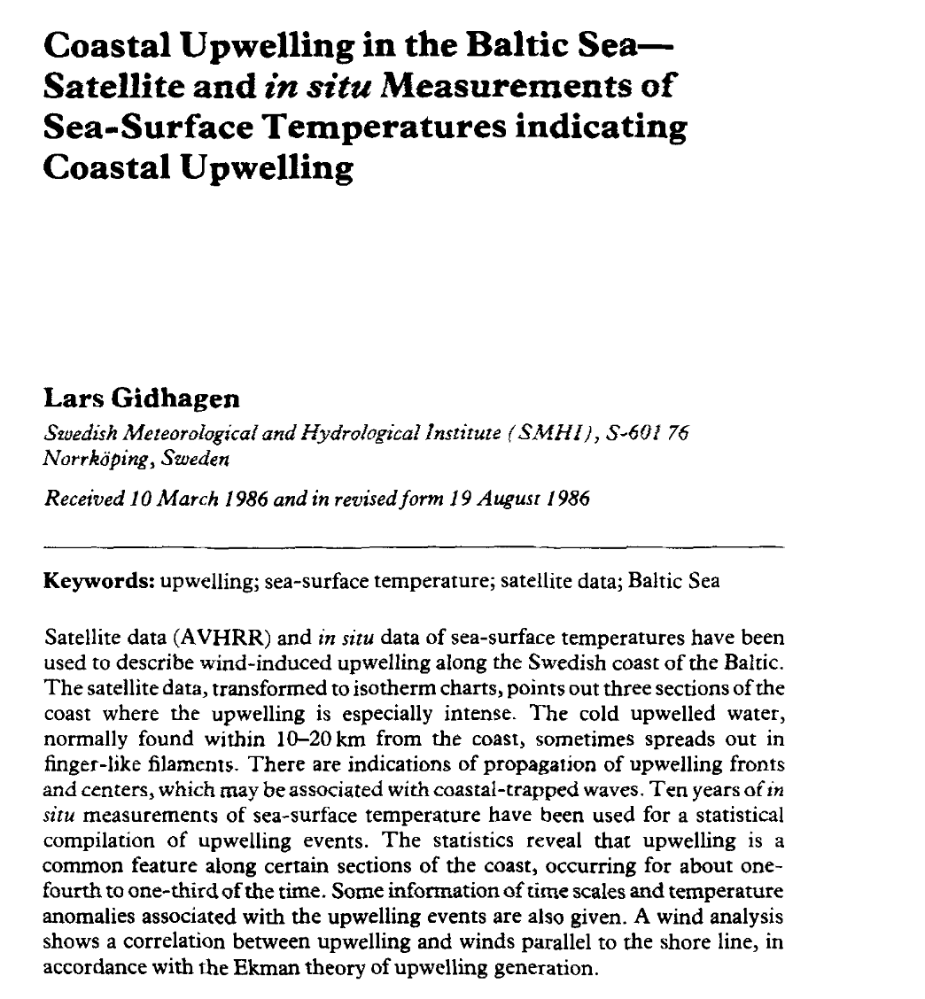
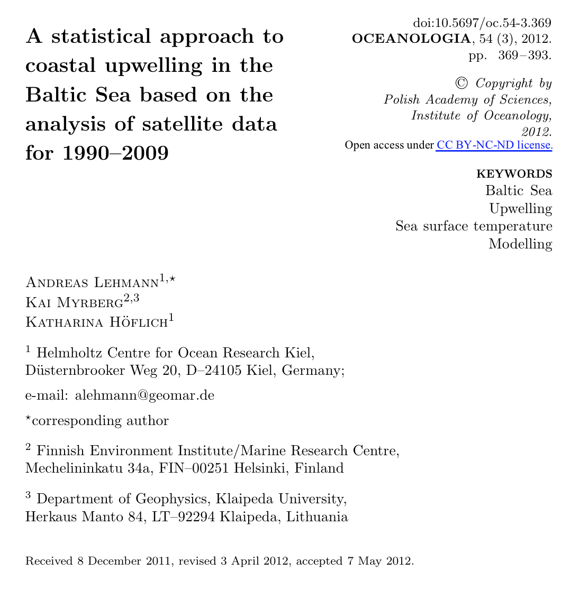

# Agenda

1. Introduction to Upwelling & Importance of Upwelling

2. Automatic Detection Method: Algorithm for Detecting Upwelling

3. Our Automatic Detection Method (ADM)

4. Relationship of Upwelling Index with ADM

5. Results from our ADM

6. Conclusion 

---

# The Upwelling Process


---

# The Importance of Upwelling

.pull-left[

]

.pull-right[
- Brings nutrient rich water to the surface 

- Supplies nutrition necessary for biological productivity

- Coastal upwelling regions contribute roughly 50 percent of the world’s fisheries landings

]


---

# Dataset

.pull-left[

]

.pull-right[
- Daily Optimum Interpolation (OI) SST 

- 4 columns: time, latitude, longitude, and SST (sea surface temperature)

- **SST** is defined as the water temperature close to the ocean’s surface.

]


---

# Past Work in Detecting Upwelling

.pull-left[

Gidhagen (1987): _Abnormal temperature drop of at least 2°C compared to earlier and surrounding measurements_

```{r, echo = FALSE}

```


]

--


.pull-right[

Lehmann, Myrberg, and Höflich (2012): _Temperature difference for each individual pixel from the zonal mean temperature, for every pixel line_


```{r, echo = FALSE}

```


]


---

# Our Automatic Detection Method (ADM)

* Looks at each latitude and finds the SST of the coastal water (water closest to land) and the SST of water 2 and 3 degrees away from land (_SST coast 2_ and _SST coast 3_)


* Computes two differences: the difference in SST between the coastal water and _SST coast 2_ and the difference in SST between the coastal water and _SST coast 3_.


* Checks if either of these two differences exceeds a threshold of 2°C

  + If it does, we indicate **upwelling** at the specific latitude
  + If not, we indicate **non-upwelling**.
  
  
---

# Our Automatic Detection Method (ADM)


```{r, echo = FALSE, out.height="520px"}
knitr::include_graphics("http://insidethetv.rbind.io/post/2021-09-10-automatic-detection-of-upwelling/images/stamen-map-final.png")
```


---


# Exploration of Upwelling Percentage

> Upwelling percentage: Proportion of days over relevant timeframe in a figure that are categorized as upwelling by our automatic detection method.

---

# Exploration of Upwelling Percentage (I)


---

# Exploration of Upwelling Percentage (II)


---

# Exploration of Upwelling Percentage (III)


---

# Exploration of Upwelling Percentage (IV)


---

# Changes in Upwelling Phenology


---

# Changes in Upwelling Duration

```{r, echo = FALSE, out.height="520px"}
knitr::include_graphics("http://insidethetv.rbind.io/post/2021-09-10-automatic-detection-of-upwelling/images/duration-upwelling.png")
```


---

# Discussion of ADM

- _Naidu et al. (1999): Studied monsoonal upwelling along the West / East coasts of India using monthly mean local temperature anomaly (LTA)_

--

- _Smitha et al. (2008): Also used LTA as an upwelling index_

--

- _Holmes et al.(2021): Used SST differential to study upwelling in the Southeast Arabian Sea_


---

# Discussion of Strength of Upwelling

- _Hickey and Banas (2003): In general, the strength and duration of upwelling increases to the south in the PNW_

--

- _Bograd et al. (2009): Developed a set of indexes to understand the coastal upwelling in the California Current large marine ecosystem (CCLME)_


---

# Conclusion

1. Southern latitudes (40°N ~ 45°N) had higher upwelling percentages than Northern latitudes (45°N ~ 50°N)

2. Found the upwelling months (upwelling percentage higher than 25%) to be from June to October and the non-upwelling months from November to May

3. Upwelling started later for northern latitudes (45.0°N to 50.0°N) around August and September. 

4. Northern latitudes had shorter duration of upwelling than the southern latitudes.


---

# Thank You for listening!


<br>

### Contact: howardba@uw.edu
